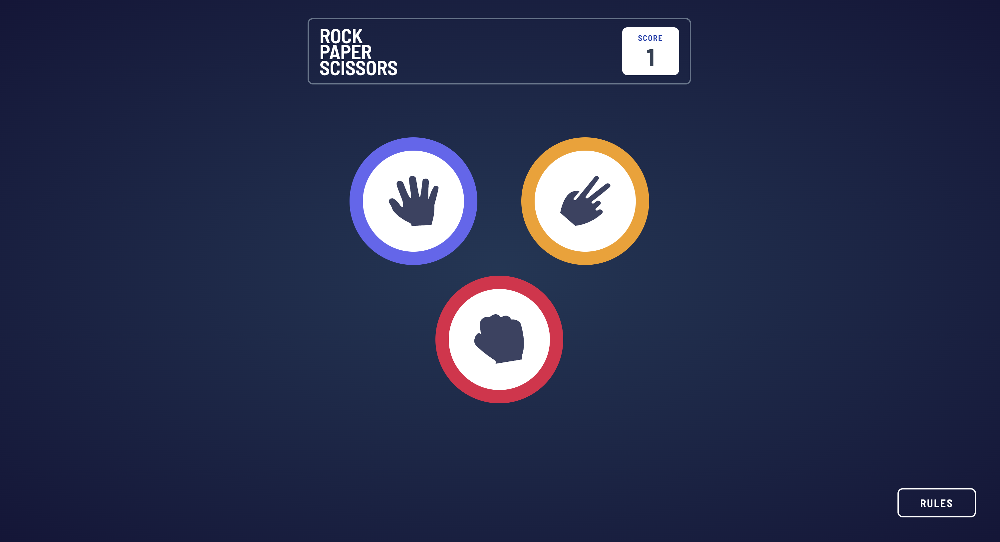

# Frontend Mentor - Rock, Paper, Scissors solution

This is a solution to the [Rock, Paper, Scissors challenge on Frontend Mentor](https://www.frontendmentor.io/challenges/rock-paper-scissors-game-pTgwgvgH). Frontend Mentor challenges help you improve your coding skills by building realistic projects.

## Table of contents

- [Frontend Mentor - Rock, Paper, Scissors solution](#frontend-mentor---rock-paper-scissors-solution)
  - [Table of contents](#table-of-contents)
  - [Overview](#overview)
    - [The challenge](#the-challenge)
    - [Screenshot](#screenshot)
    - [Links](#links)
    - [Built with](#built-with)

## Overview

### The challenge

Users should be able to:

- Play Rock, Paper, Scissors against the computer
- Maintain the state of the score after refreshing the browser
- Open rule in a Dialog

### Screenshot

### Links

- Live Site URL: [https://rock-paper-scissors-nine-delta.vercel.app/](https://rock-paper-scissors-nine-delta.vercel.app/)

### Built with

- Semantic HTML5 markup
- Tailwind
- React
- TypeScript
- Vite
